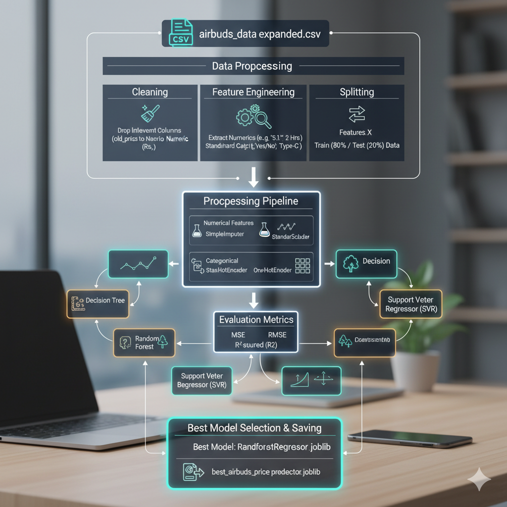

# 🎧 Airbuds Price Predictor 💰

**Predict the price of Airbuds based on their features — powered by Machine Learning!**  
This project uses a trained regression model to estimate the price of wireless earbuds by analyzing key specifications such as noise cancellation, water resistance, battery capacity, and more.

---

## 🚀 Project Overview

The **Airbuds Price Predictor** is an end-to-end machine learning web application that allows users to input various specifications of Airbuds and get an estimated price.  
It aims to assist users, sellers, and enthusiasts in understanding how product features influence market prices.

---

## 🧠 Features

- 💬 **Interactive UI:** User-friendly interface to input earbud features.  
- 🤖 **Machine Learning Model:** Predicts prices based on learned patterns from real-world data.  
- ⚡ **Instant Results:** Get an estimated price in just one click!  
- 📊 **Data-Driven Insights:** Trained on actual Airbuds data scraped from **PriceOye.pk**.

---

## 🧩 Input Field Guide

| Field | Description |
|-------|--------------|
| **Noise Cancellation** | Does the earbud feature ANC/ENC? (`Yes`/`No`) |
| **Water Resistant** | Is the earbud water resistant (e.g., IPX4, IPX5)? (`Yes`/`No`) |
| **Charging Interface** | Type of charging port (e.g., `Type-C`, `Micro USB`, `Lightning`) |
| **Auto Pairing** | Does it support automatic pairing? (`Yes`/`No`) |
| **Compatibility** | Supported operating systems (e.g., Android, iOS) |
| **Mic** | Built-in microphone (`Yes`/`No`) |
| **Driver Size** | Audio driver size (e.g., `10mm`, `13mm`) |
| **Bluetooth Version** | Bluetooth version (e.g., `5.0`, `5.2`) |
| **Bluetooth Range** | Range in meters (e.g., `10m`) |
| **Microphone (Connectivity)** | Whether a separate mic is listed (`Yes`/`No`) |
| **Capacity for Buds** | Battery capacity per earbud (mAh) |
| **Capacity for Case** | Battery capacity of charging case (mAh) |
| **Playtime** | Playtime duration (e.g., `5-6 Hrs`) |
| **Charging Time** | Time required to fully charge (e.g., `1.5 Hrs`) |

---

## 💰 Example Prediction

| Input | Output |
|--------|---------|
| Noise Cancellation: Yes  | **Predicted Price:** Rs 2,424.82 |
| Water Resistant: IPX7 | |
| Charging Interface: Type-C | |
| Playtime: 5-6 Hrs | |

> ⚠️ *Note: This is an estimated price. Real prices may vary.*

---

## 🧮 Tech Stack

- **Language:** Python 🐍  
- **Framework:** Flask  
- **Frontend:** HTML, CSS, Bootstrap  
- **Machine Learning:** scikit-learn  
- **Data Handling:** Pandas, NumPy  
- **Model:** Linear Regression / Random Forest Regressor  

---

## 🧰 Installation and Setup

### 1️⃣ Clone this repository

git clone https://github.com/<your-username>/airbuds-price-predictor.git
cd airbuds-price-predictor
### 2️⃣ Create and activate a virtual environment

python -m venv venv
venv\Scripts\activate   # For Windows
# or
source venv/bin/activate  # For Mac/Linux
### 3️⃣ Install dependencies

pip install -r requirements.txt
### 4️⃣ Run the Flask app

python app.py
Then open your browser and go to 👉 http://127.0.0.1:5000

### 📊 Model Training Workflow
🔹 1. Data Collection
The dataset was scraped from PriceOye.pk using BeautifulSoup and Requests.
Each product entry includes attributes like:

Brand

Price

Noise Cancellation

Battery Capacity

Bluetooth Version

Compatibility, etc.

🔹 2. Data Cleaning
Removed missing and duplicate entries

Converted playtime (e.g., "5-6 Hrs") into numerical averages

Extracted numeric values from text like "IPX7", "10mm", "300mAh"

🔹 3. Feature Engineering
Encoded categorical features using LabelEncoder / OneHotEncoder

Converted “Yes/No” fields to binary (1/0)

Scaled numerical columns for model training

🔹 4. Model Selection
Tried multiple models:

Linear Regression — Simple, interpretable baseline

Random Forest Regressor — Best performance with low MAE and high R² score

🔹 5. Model Evaluation
Metrics used:

Mean Absolute Error (MAE)

Root Mean Squared Error (RMSE)

R² Score

Random Forest achieved the best balance between accuracy and generalization.

🔹 6. Model Saving
The best model was serialized using:

import pickle
pickle.dump(model, open('model.pkl', 'wb'))
🔹 7. Flask Integration
The model was integrated into a Flask app for real-time predictions:

Takes user input from a web form

Converts input into model-ready format

Displays the predicted price instantly on the page

### 📦 Dataset
Source: PriceOye.pk - Wireless Earbuds

Scraping Tools: BeautifulSoup, Requests

Format: CSV (features + price column)

Samples: 500+ products

### 📈 Future Enhancements
✅ Add model comparison dashboard (Linear, Ridge, Random Forest, XGBoost)

🌍 Deploy on Streamlit or Hugging Face Spaces

📱 Make UI mobile-friendly

🧠 Add feature importance visualization

🗄️ Build REST API for integration with other apps

### 🖼️ Project Screenshot
(Optional: Add image here later)

❤️ Created By
Zuhaib Hussain Butt
Data Science Lecturer | ML Developer | Freelancer

📧 Email Me : zuhaibbutt3@gmail.com
🌐 LinkedIn
💼 Fiverr: fiverr.com/zuhaibhussainbutt

🏁 “Created with ❤️ for Airbuds Enthusiasts”
